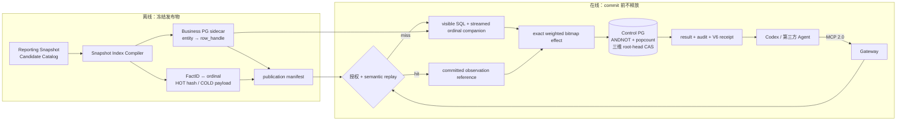

# 架构与安全边界

Gateway 把数据访问绑定到不可扩权的 `TaskGrant`，并把累计数据暴露绑定到
签名的根任务族：主体、目的、产品、字段、强制 Scope、敏感级别、资源预算、
三维 exposure 预算、期限、Catalog 版本和审批凭证缺一不可。Agent 提交的
结构化对象、QueryPlan 和 SQL 都是不可信输入；Gateway 内没有模型调用。



## 信任域

| 信任域 | 输入与职责 | 边界 |
|---|---|---|
| Agent / MCP 客户端 | 显式提交产品、字段、Scope、QueryPlan 或 SQL | Bearer Token 映射固定 Principal；Alice 只能访问自己的任务，Carol 只有审计工具 |
| Gateway 控制面 | Catalog、任务族、OA 回调、Grant、资源预算、三维 root head、字典/bitmap、结果与审计 | 独立 Control PG；一次 epoch CAS 同时发布 R/I/O；容器和 set manifest 内容寻址且不可变；Grant 与审计 Trigger 禁止修改 |
| 业务数据面 | 执行可见查询及 streamed ordinal companion | 独立 Business PG；`gateway_reader` 仅有 Attestation、Reporting Views 和 immutable sidecar 的 `SELECT`；同一只读 `REPEATABLE READ` 事务、超时和行数上限 |

Docker 宿主机、Catalog 管理者及能读取 `.env`/Volume 的管理员属于可信运维域。默认只发布 Control PG 回环调试端口；Business PG 仅内部网络可达，只有非论文 `compose.debug.yaml` 覆盖会发布回环端口。两库账号、数据库和 Volume 相互独立。

## 完整数据流

1. Agent 调用 `list_data_products`，读取逻辑产品、字段和 Scope 的完整允许值/日期边界。
2. Agent 调用 `request_data_task`，显式提交目的、非空产品列表、每个产品的非空字段列表和 Scope。委托任务还必须提交父任务和目标 Principal。Gateway 不推断缺失授权，Agent 也不提交预算。
3. Gateway 按 Catalog 校验并规范化申请，确定敏感级别与审批路由，并把路由所指完整 Profile 的资源预算、release/influence/outcome 上限和 TTL 绑定到 Manifest。委托任务自动取 Catalog Profile 与父 Grant 的逐维交集；这防止扩权，不是预算利用率优化。
4. Gateway 构造身份派生的 `AuthorizationManifestV1`，绑定 root/parent lineage，经 RFC 8785 规范化并使用 `TASKGATE-MANIFEST-V1\0` 域分隔计算 SHA-256；同时保存 pending 上下文并创建 OA 草稿。
5. OA 可 `approve/reject/narrow`。回调处理校验 HMAC、双时间戳、Event ID、状态、actor、Catalog/context/Manifest 摘要、Grant 单调收缩和 OA Ed25519 `ApprovalReceiptV1`。在一个 PostgreSQL 事务中写审批事件、不可变最终 Grant、预算和状态。
6. V4 Product 必须引用一个经过完整 digest 校验的 `snapshot_publication`。发布前，Compiler 离线扫描冻结快照，用现有 canonical FactID 编码建立 row/cell segments、`row_handle` sidecar、HOT hash/ordinal 索引和 COLD payload 块；重复 entity key、越界 ordinal、hash/payload collision 或 manifest 不一致都阻止发布。
7. ACTIVE exposure 任务调用带必填 `request_id` 的 `execute_plan`。QueryPlan 由本地 Go 包严格验证，并确定性编译成可见查询和 ordinal companion；两条 SQL 都经过 `pg_query_go/v6` PostgreSQL AST 白名单策略。Exposure grant 下的任意 `query_sql` 会关闭式拒绝。
8. 策略把 Reporting View 封装为只暴露获批字段和强制 Scope 的 CTE。可见结果小规模缓冲；companion 在同一只读 `REPEATABLE READ` 事务中按 canonical group 流式返回 handle 和必要聚合值，不全量物化关系。
9. Gateway 以 exact bitmap 表示 base release/dependency，以小型动态字典表示 derived release/outcome。Control PG 对三个维度执行 `ANDNOT + popcount`，在一次 root-head epoch CAS 中发布三份新 set manifest；任何越界、CAS/字典故障或证据截断都回滚整笔事务。
10. distinct-request semantic replay 只复用已提交 observation 与密文结果；仍重新授权、扣普通查询/行资源、写审计和新 receipt，并为新 query AAD 重加密。命中不执行 Business/provenance SQL；跨 grant/dictionary、密钥擦除或结果清理一律 miss。
11. 资源结算、AES-256-GCM 结果、终态审计、materialization cache 和 Ed25519 V6 receipt 与 root head 在同一事务提交，commit 后才释放 JSON。V6 绑定 dictionary set、三维 effect digest、actual/charged counts、root epoch 和 result digest；旧 verifier 保留但不复用 V6 digest 语义。

Exposure 语义、代数和在线支持矩阵见[任务级数据暴露记账](exposure-accounting.md)。

## 生命周期

```text
AWAITING_SUBMISSION --submitted--> AWAITING_APPROVAL
AWAITING_APPROVAL   --approved-->  ACTIVE
AWAITING_APPROVAL   --narrowed-->  ACTIVE
AWAITING_APPROVAL   --rejected-->  ARCHIVED(rejected)
ACTIVE              --complete-->  ARCHIVED(completed)
任意未归档状态       --revoke-->    ARCHIVED(revoked)
任意未归档状态       --expire-->    ARCHIVED(expired)
ACTIVE 达到任一资源预算硬上限       ARCHIVED(budget_exhausted)
```

任务归档后不再接受新的查询，但已有查询结果、查询记录、回执和审计证据仍按保留策略存在。`get_query_result` 允许任务所有者读取已保存的旧结果，直到结果保留清理删除 `encrypted_query_results` 密文，或管理员擦除该密文绑定的 `result_encryption_keys.key_id`；清理后原始行不可再读，Key 被标记 `ERASED` 后密文行仍保留但读取会 fail closed，查询记录、回执和审计链均仍保留。清理可由 `GATEWAY_RESULT_RETENTION_TTL` 调度，也可由带 `GATEWAY_ADMIN_TOKEN` 的管理员接口按截止时间触发；任务处于 active legal hold 时，其结果密文不会被保留清理删除。禁用 Principal 后，即使旧 Bearer Token 仍被客户端持有，Gateway 也不再列出或执行任何工具。

## 控制 PostgreSQL

控制 Schema 使用 PostgreSQL 原生类型：时间为 `TIMESTAMPTZ`，JSON 为 `JSONB`，密文/Nonce/回调响应为 `BYTEA`，预算和审计序号为 `BIGINT`。应用写入时间统一为 UTC 微秒精度。

Gateway 启动时执行嵌入式迁移，再完成中断恢复：

- RESERVED 查询按完整资源预留量保守计费并标记 `INDETERMINATE`，释放尚未结算的 exposure reservation，同时在配置查询回执签名密钥时于同一恢复事务中写入 V3 回执；由于结果从未在提交前释放，这不会增加已知事实。同一 `request_id` 禁止自动重执行。
- PROCESSING 回调恢复为可重试。
- 过期任务被归档。
- 运行期结算持久化失败会使 readiness 失败并由后台重试。

当前仍只部署一个 Gateway 实例。PostgreSQL 行锁解决单实例内并发请求安全，但没有跨 Gateway 执行租约；在实现分布式租约或等价协调前不要横向扩容 Gateway。

## 防御纵深

- Catalog 启动时严格校验未知字段、重复对象、明文密码、非法物理 View、危险函数和不一致 Scope。
- QueryPlan 只包含声明式字段；编译器验证产品、字段、聚合、过滤 literal、排序和 Limit，不接受 SQL 片段。
- V4 QueryPlan 同时生成可见查询与 streamed ordinal companion；Connector 将二者绑定到一个只读数据库快照，隐藏 handle/计量键在返回前移除。
- 每个 snapshot dictionary segment 都是 canonical FactID 与 ordinal 的不可变双射；精确 bitmap OR/ANDNOT/popcount 与 FactSet 并/差/基数等价。
- 所有子 Agent 共享一个三维 root head；一次 epoch CAS 和事务内上限检查共同阻止重试、分页重叠、委托及并发结算重复消费。
- SQL 决策基于 PostgreSQL AST，策略错误不返回物理对象名或解析器细节。
- 业务数据库角色权限、只读连接/事务、服务端超时和行数上限独立于应用策略。
- PostgreSQL Trigger 阻止 Grant 与审计事件的 UPDATE/DELETE；Hash Chain 提供有限的日志修改检测证据。
- Gateway 与 OA 容器以非 root、只读根文件系统和 `no-new-privileges` 运行；HTTP 与 Control PG 只开放在宿主机回环地址，Business PG 默认不发布。

静态 Token、本地明文 HTTP、环境变量密钥、未外部锚定审计链、内存态 OA 和单 Gateway 限制见[威胁模型](threat-model.md)。
