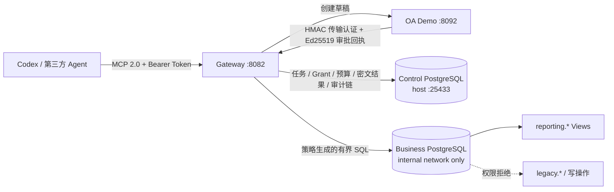

# 架构与安全边界

Gateway 把数据访问绑定到不可扩权的 `TaskGrant`：主体、目的、产品、字段、强制 Scope、敏感级别、预算、期限、Catalog 版本和审批凭证缺一不可。Agent 提交的结构化对象、QueryPlan 和 SQL 都是不可信输入；Gateway 内没有模型调用。



## 信任域

| 信任域 | 输入与职责 | 边界 |
|---|---|---|
| Agent / MCP 客户端 | 显式提交产品、字段、Scope、QueryPlan 或 SQL | Bearer Token 映射固定 Principal；Alice 只能访问自己的任务，Carol 只有审计工具 |
| Gateway 控制面 | Catalog、任务状态、OA 回调、Grant、预算、结果与审计 | 独立控制 PG；行级锁串行化状态和预算；Grant/审计 Trigger 禁止修改；审计链头加锁后连续追加 |
| 业务数据面 | 执行通过策略的查询 | 独立业务 PG；`gateway_reader` 仅有 Datasource Attestation 表与 Reporting Views 的 `SELECT`；只读事务、超时和行数上限 |

Docker 宿主机、Catalog 管理者及能读取 `.env`/Volume 的管理员属于可信运维域。默认只发布 Control PG 回环调试端口；Business PG 仅内部网络可达，只有非论文 `compose.debug.yaml` 覆盖会发布回环端口。两库账号、数据库和 Volume 相互独立。

## 完整数据流

1. Agent 调用 `list_data_products`，读取逻辑产品、字段和 Scope 的完整允许值/日期边界。
2. Agent 调用 `request_data_task`，显式提交目的、非空产品列表、每个产品的非空字段列表、Scope 和可选缩小预算。Gateway 不推断缺失授权。
3. Gateway 按 Catalog 校验并规范化申请，确定敏感级别、审批路由、预算和 TTL；客户端预算只能缩小 Profile 上限。
4. Gateway 构造身份派生的 `AuthorizationManifestV1`，经 RFC 8785 规范化并使用 `TASKGATE-MANIFEST-V1\0` 域分隔计算 SHA-256；同时保存 pending 上下文并创建 OA 草稿。
5. OA 可 `approve/reject/narrow`。回调处理校验 HMAC、双时间戳、Event ID、状态、actor、Catalog/context/Manifest 摘要、Grant 单调收缩和 OA Ed25519 `ApprovalReceiptV1`。在一个 PostgreSQL 事务中写审批事件、不可变最终 Grant、预算和状态。
6. ACTIVE 任务可调用带必填 `request_id` 的 `execute_plan` 或 `query_sql`。QueryPlan 由本地 Go 包严格验证并确定性编译；两条路径随后经过同一套 `pg_query_go/v6` PostgreSQL AST 白名单策略。
7. 策略把物理 Reporting View 封装为只暴露获批字段和强制 Scope 的 CTE，并在最外层施加剩余行预算。
8. 控制库以 `(task_id, request_id)` 唯一约束和任务行锁完成幂等检查，再预留查询数、行数和 DB 时间。业务库在显式只读事务中执行；确定结果按实际量结算，无法确定则按预留上限计费并标记 `INDETERMINATE`。
9. 结果以结构化 JSON 返回 Alice，并用 AES-256-GCM 加密保存到控制库；AAD 绑定 `task_id` 与 `query_id`，明文 SHA-256 用于完整性校验。
10. Gateway 生成并持久化绑定 Manifest/Grant/Catalog、请求、预算、结果、签名时间和审计位置的 Ed25519 V3 查询回执，并在 `/.well-known/taskgate/query-receipt-keyring.json` 发布 active/historical 验签公钥及有效/退役窗口。审计凭证返回终态事件、前驱事件、通向当前 checkpoint 的后继路径和 checkpoint，并在返回前重建 Hash Chain 校验。配置 `GATEWAY_AUDIT_ANCHOR_URL` 时，Gateway 会定期把当前 checkpoint 签名为 `taskgate-audit-checkpoint-anchor/v1` 并 POST 到外部日志/WORM 服务。未配置外部 Anchor 时，该链只提供 Gateway 日志修改检测，不声称 WORM 或外部不可篡改。

## 生命周期

```text
AWAITING_SUBMISSION --submitted--> AWAITING_APPROVAL
AWAITING_APPROVAL   --approved-->  ACTIVE
AWAITING_APPROVAL   --narrowed-->  ACTIVE
AWAITING_APPROVAL   --rejected-->  ARCHIVED(rejected)
ACTIVE              --complete-->  ARCHIVED(completed)
任意未归档状态       --revoke-->    ARCHIVED(revoked)
任意未归档状态       --expire-->    ARCHIVED(expired)
ACTIVE 达到任一预算硬上限           ARCHIVED(budget_exhausted)
```

任务归档后不再接受新的查询，但已有查询结果、查询记录、回执和审计证据仍按保留策略存在。`get_query_result` 允许任务所有者读取已保存的旧结果，直到结果保留清理删除 `encrypted_query_results` 密文，或管理员擦除该密文绑定的 `result_encryption_keys.key_id`；清理后原始行不可再读，Key 被标记 `ERASED` 后密文行仍保留但读取会 fail closed，查询记录、回执和审计链均仍保留。清理可由 `GATEWAY_RESULT_RETENTION_TTL` 调度，也可由带 `GATEWAY_ADMIN_TOKEN` 的管理员接口按截止时间触发；任务处于 active legal hold 时，其结果密文不会被保留清理删除。禁用 Principal 后，即使旧 Bearer Token 仍被客户端持有，Gateway 也不再列出或执行任何工具。

## 控制 PostgreSQL

控制 Schema 使用 PostgreSQL 原生类型：时间为 `TIMESTAMPTZ`，JSON 为 `JSONB`，密文/Nonce/回调响应为 `BYTEA`，预算和审计序号为 `BIGINT`。应用写入时间统一为 UTC 微秒精度。

Gateway 启动时执行嵌入式迁移，再完成中断恢复：

- RESERVED 查询按完整预留量保守计费并标记 `INDETERMINATE`，同时在配置查询回执签名密钥时于同一恢复事务中写入 V3 回执；同一 `request_id` 禁止自动重执行。
- PROCESSING 回调恢复为可重试。
- 过期任务被归档。
- 运行期结算持久化失败会使 readiness 失败并由后台重试。

当前仍只部署一个 Gateway 实例。PostgreSQL 行锁解决单实例内并发请求安全，但没有跨 Gateway 执行租约；在实现分布式租约或等价协调前不要横向扩容 Gateway。

## 防御纵深

- Catalog 启动时严格校验未知字段、重复对象、明文密码、非法物理 View、危险函数和不一致 Scope。
- QueryPlan 只包含声明式字段；编译器验证产品、字段、聚合、过滤 literal、排序和 Limit，不接受 SQL 片段。
- SQL 决策基于 PostgreSQL AST，策略错误不返回物理对象名或解析器细节。
- 业务数据库角色权限、只读连接/事务、服务端超时和行数上限独立于应用策略。
- PostgreSQL Trigger 阻止 Grant 与审计事件的 UPDATE/DELETE；Hash Chain 提供有限的日志修改检测证据。
- Gateway 与 OA 容器以非 root、只读根文件系统和 `no-new-privileges` 运行；HTTP 与 Control PG 只开放在宿主机回环地址，Business PG 默认不发布。

静态 Token、本地明文 HTTP、环境变量密钥、未外部锚定审计链、内存态 OA 和单 Gateway 限制见[威胁模型](threat-model.md)。
