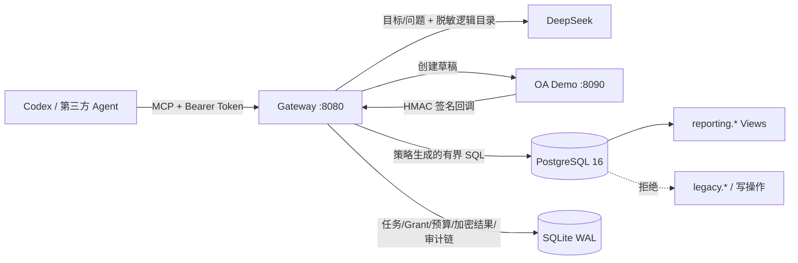

# 一页式架构与安全边界

## 目标

Gateway 把一次数据访问绑定到一个不可扩权的 `TaskGrant`：主体、目的、产品、字段、强制范围、敏感级别上限、预算、期限、目录版本和审批凭证缺一不可。Agent、自然语言模型和 Agent 生成的 SQL 都按不可信输入处理。



## 三个信任域

| 信任域 | 输入与职责 | 边界 |
|---|---|---|
| Agent / MCP 客户端 | 提交目标、问题或直接 SQL | 静态 Bearer Token 认证；Alice 只能访问自己的任务，Carol 只有审计工具；所有工具响应含 `trace_id` |
| Gateway 控制面 | 目录策略、任务状态、OA 回调、Grant、预算、SQL 审计、结果与凭证 | SQLite 单实例事务；Grant 不可更新；预算预留与结算原子化；审计事件不可更新/删除并组成 SHA-256 Hash Chain |
| 数据面 | 执行已通过策略的查询 | `gateway_reader` 只拥有 `reporting.expense_summary` 与 `reporting.expense_detail` 的 `SELECT`；显式只读事务、`statement_timeout`、`search_path=pg_catalog` 和行数上限 |

Docker 宿主机、Catalog 管理者以及能读取 `.env`/Volume 的管理员属于可信运维域。拥有这些权限的人可以读取密钥、替换目录或直接修改持久化数据，因此 Demo 不把宿主机入侵纳入可防御边界。

## 完整数据流

1. Alice 调用 `request_data_task`。DeepSeek 只接收目标和不含 DSN/物理表名的逻辑目录，输出候选 `TaskIntent`。
2. Gateway 严格解析 JSON，并由 Catalog 确定数据产品、最高敏感级别、强制 `department` 范围、审批路由、预算和 TTL。客户端和模型只能缩小预算，不能提高上限。
3. Gateway 把规范化产品、字段、强制范围、完整预算、TTL、目录版本和审批路由组成授权快照，计算 SHA-256 后同时写入本地 pending 与 OA 草稿。OA 页面明确展示该快照，Alice 在 OA 提交后进入 `AWAITING_APPROVAL`。
4. 低敏汇总由 OA 自动批准；高敏明细由 Bob 决定。Gateway 校验 HMAC、双时间戳、事件 ID、草稿、目录版本、回调上下文、合法 actor 与授权快照 Hash，并从本地 pending 重算 Hash；随后在一个 SQLite 事务内写审批事件、Grant、预算和任务状态。
5. ACTIVE 任务执行查询时，Gateway 先校验所有权、目录版本和剩余预算，再用 `pg_query_go/v6` 解析 PostgreSQL AST。通过后为逻辑产品生成受 Grant 限制的 CTE，外层再施加剩余行预算。
6. Gateway 先在 SQLite 预留一次查询、行数和 DB 时间，再在 PostgreSQL 只读事务中执行。同一任务同时只能有一个查询；成功或失败都会结算已允许的消耗。
7. 结果作为结构化 JSON 返回 Alice，同时使用 AES-256-GCM 加密后写入 SQLite；AAD 绑定 `task_id` 与 `query_id`，另存明文 SHA-256 用于完整性校验。
8. 查询记录保存请求摘要、SQL 指纹、目录版本、策略结论、行数/耗时、预算前后值、结果 Hash 和时间；状态事件加入全局 Hash Chain。Carol 可读凭证但没有原始结果工具。

## 生命周期与硬终止

```text
AWAITING_SUBMISSION --submitted--> AWAITING_APPROVAL
AWAITING_APPROVAL   --approved-->  ACTIVE
AWAITING_APPROVAL   --rejected-->  ARCHIVED(rejected)
ACTIVE              --complete-->  ARCHIVED(completed)
任意未归档状态       --expire-->    ARCHIVED(expired)
ACTIVE 达到任一预算硬上限           ARCHIVED(budget_exhausted)
```

控制面还支持 `revoked` 与 `failed` 终止原因，但当前 Demo 没有面向用户的撤销管理接口。

## 防御纵深

- Catalog 启动时严格校验，未知字段、重复对象、明文密码、非法 Reporting View、危险函数、缺失审批路由或产品 scope 与字段不匹配都会使 Gateway 启动失败。
- DeepSeek 不接收数据库凭据或查询结果；模型输出只作为候选 JSON，并且最多修复一次，失败即拒绝。
- SQL 决策基于 PostgreSQL AST，不以正则或关键字扫描充当安全判断；策略错误不返回物理对象名或解析器细节。
- PostgreSQL 角色权限、只读事务、服务端超时和行数上限独立于 AST 策略生效。
- SQLite 开启 WAL、外键和完整同步；运行期结算失败会使 readiness 失败并在后台幂等重试。启动恢复会把不确定的中断查询按完整预留量保守计费、使未完成回调可重试并归档过期任务。
- Gateway 与 OA 容器以非 root 用户、只读根文件系统和 `no-new-privileges` 运行，只开放本机 `127.0.0.1:8080/8090`。

这些控制不等于生产完备性：静态 Token、本地 HTTP、环境变量密钥、未外部锚定的审计链、内存态 OA 和单实例 SQLite 等残余风险见[威胁模型与生产化差距](threat-model.md)。
