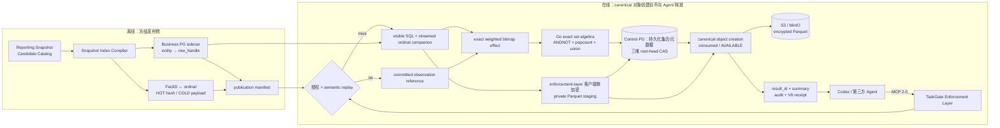

# 架构与安全边界

TaskGate Enforcement Layer 把数据访问绑定到不可扩权的 `TaskGrant`，并把累计数据暴露绑定到
签名的根任务族：主体、目的、产品、字段、强制 Scope、敏感级别、资源预算、
三维 exposure 预算、期限、Catalog 版本、task-scoped View binding 和审批凭证缺一不可。Agent 提交的
结构化对象、QueryPlan 和 SQL 都是不可信输入；该确定性执行边界内没有模型调用。
本文用 **TaskGate Enforcement Layer** 指研究架构中的执行边界；现有二进制路径、
环境变量、数据库角色和兼容 API 标识中的 `gateway`/`GATEWAY_*` 保持不变。



## 信任域

| 信任域 | 输入与职责 | 边界 |
|---|---|---|
| Agent / MCP 客户端 | 显式提交产品、字段、Scope 和报表 SQL；高级客户端可提交 QueryPlan | Bearer Token 映射固定 Principal；Alice 只能访问自己的任务，Carol 只有审计工具 |
| TaskGate Enforcement Layer | Catalog、任务族、OA 回调、Grant、资源预算、三维 root head、字典/bitmap、result artifact 元数据与审计 | 独立 Control PG；不保存新结果的 Parquet 或结果行；一次 epoch CAS 同时发布 R/I/O；容器和 set manifest 内容寻址且不可变；Grant 与审计 Trigger 禁止修改 |
| 业务数据面 | 执行可见查询及 streamed ordinal companion | 独立 Business PG；`gateway_reader` 仅有 Attestation、Reporting Views 和 immutable sidecar 的 `SELECT`；同一只读 `REPEATABLE READ` 事务、超时和行数上限 |
| 结果对象存储 | 保存 Gateway 客户端侧分块 AES-GCM 加密的 Parquet staging/canonical 对象 | S3 兼容私有 bucket，且必须禁用 versioning，以保证 TTL/purge 真正删除 bytes；默认 Compose 使用 MinIO、独立 `result-storage` 内部网络及 bucket-scoped Gateway 凭据；Agent 不能直接列举对象键 |

Docker 宿主机、Catalog 管理者及能读取 `.env`/Volume 的管理员属于可信运维域。默认只发布 Control PG 回环调试端口；Business PG 仅内部网络可达，只有非论文 `compose.debug.yaml` 覆盖会发布回环端口。两库账号、数据库和 Volume 相互独立。

## 完整数据流

1. Agent 调用 `list_data_products`、`describe_data_product` 和 `get_sql_capabilities`，读取逻辑产品、字段、Catalog 稳定角色、Scope 和 `taskgate-reporting-sql-v1` 能力边界。
2. Agent 调用 `request_data_task`，显式提交目的、非空产品列表、每个产品的非空字段列表和 Scope。委托任务还必须提交父任务和目标 Principal。Gateway 不推断缺失授权，Agent 也不提交预算。
3. Gateway 按 Catalog 校验并规范化申请，确定敏感级别与审批路由，并把路由所指完整 Profile 的资源预算、release/influence/outcome 上限和 TTL 绑定到 Manifest。若请求包含 `view_contract` product，Gateway 只发现这些 semantic roots 的传递依赖，在一个只读 `REPEATABLE READ` registry snapshot 中编译 restricted View closure，并验证 Catalog 固定的四个摘要。委托任务自动取 Catalog Profile 与父 Grant 的逐维交集；这防止扩权，不是预算利用率优化。
4. Gateway 构造身份派生的 `AuthorizationManifestV1`，绑定 root/parent lineage 和规范 task View binding digest，经 RFC 8785 规范化并使用 `TASKGATE-MANIFEST-V1\0` 域分隔计算 SHA-256；同时保存 binding 的 canonical set、反向依赖索引所需证据及其他 pending 上下文，并创建 OA 草稿。没有 semantic root 的 legacy task 保持空 binding。
5. OA 可 `approve/reject/narrow`。回调处理校验 HMAC、双时间戳、Event ID、状态、actor、Catalog/context/Manifest 摘要、Grant 单调收缩和 OA Ed25519 `ApprovalReceiptV1`；semantic task 在激活前再次发现并比对 binding。在一个 PostgreSQL 事务中写审批事件、不可变最终 Grant、内容寻址 binding set、task dependency rows、预算和状态。
6. V4 Product 必须引用一个经过完整 digest 校验的 `snapshot_publication`。发布前，Compiler 离线扫描冻结快照，用现有 canonical FactID 编码建立 row/cell segments、`row_handle` sidecar、HOT hash/ordinal 索引和 COLD payload 块；重复 entity key、越界 ordinal、hash/payload collision 或 manifest 不一致都阻止发布。
7. ACTIVE exposure 任务调用带必填 `request_id` 的 `query_sql`。Gateway 用 PostgreSQL AST 将受支持 SQL 无损 lowering 为 canonical QueryPlan：SQL alias 先映射为 Catalog 稳定角色，2–16 源内任意 connected INNER equi-join graph 形状的 nodes/edges/predicates 规范排序后转换为现有 `join_many`，再 deterministic binary fold 为现有二元代数。每条 edge 可包含多个 column-to-column equality predicate；16-source 上限是 operational complexity/DoS ceiling，并允许 10 表 Join。若单产品计划指向 semantic root，Gateway 将 public output 经 `Artifact.Output.FieldID` 合成到已展开计划，然后同样进入 `CompileRelational`/`join_many`；不会直接把 root View 当作计量源。Gateway 只执行 QueryPlan 重新生成的可见查询和 ordinal companion；两条 SQL 都再经 `pg_query_go/v6` PostgreSQL AST 白名单策略，整个入口还受 1 MiB MCP 请求体和获批资源边界约束。普通 `tools/list` 不列出 `execute_plan`，但 SDK/内部测试/确定性工作流仍可调用该高级入口，并共用同一 QueryPlan 编译与记账边界。
8. 策略把 Reporting View 封装为只暴露获批字段和强制 Scope 的 CTE。对 semantic task，Gateway 在 reservation 前先重算 task binding，保持签名/public Grant 仅包含 root，再从已绑定 Artifact 每查询派生最小 terminal internal grants。Root scope output 通过 `Artifact.Output.FieldID` 映射到 terminal 字段，且每个 terminal mandatory scope 都必须被同一任务范围覆盖；无法完整映射则在预留前拒绝。V4 对展开计划的每个 terminal 绑定它自身的 frozen publication ordinal 和 sidecar。Connector 随后在执行 SQL 的同一个只读 `REPEATABLE READ` 事务内重新发现已绑定 closure 并比对 revision digest，再缓冲可见结果、按 canonical group 流式返回 handle 和必要聚合值。该二次验证与 SQL 共享数据库快照，避免 `CREATE OR REPLACE VIEW` 插入检查—执行窗口。Gateway 把最终可见投影编码为 Parquet，并在写入对象存储前以结果 key 和 AAD 进行客户端侧分块加密；private staging 对象不会交给 Agent。
9. TaskGate Enforcement Layer 以 exact bitmap 表示 base release/dependency，以小型动态字典表示 derived release/outcome；Go control path 从 Control PG 加载已提交集合，执行三个维度的 `ANDNOT + popcount` 和 exact union。随后同一个 Control PG 事务持久化集合内容，并以一次 root-head epoch CAS 发布三份新 set manifest；任何越界、CAS/字典故障或证据截断都回滚整笔事务。
10. distinct-request semantic replay 只复用已提交 observation 与 `AVAILABLE` artifact；replay key 绑定 task/Grant、Catalog/schema、task View binding、dictionary set 与 typed plan。它仍重新授权、扣普通查询/行资源、写审计和新 receipt，并为新 query 创建自己的加密 Parquet artifact。materialization 可在结算事务中引用 `PENDING/AVAILABLE` source，但查询命中只接受 `AVAILABLE + ACTIVE key`。命中不执行 Business/provenance SQL；跨 grant/binding/dictionary、密钥擦除、TTL 或对象清理一律 miss。
11. Control PostgreSQL 在同一事务提交资源/exposure 结算、`PENDING` artifact 元数据、终态审计、materialization cache 和 Ed25519 V6 receipt；它不保存 Parquet bytes。事务提交后，Gateway 把 staging 对象幂等提升到确定性的 canonical key。canonical 对象创建成功就是消费事件，随后元数据变为 `AVAILABLE`，`query_sql`/`execute_plan`/`get_query_result` 只返回 `result_id`、行列数、期限和摘要，不返回 `rows` 或对象键。promotion 中断时保留 PENDING intent，由启动与后台只在 staging/已提交证据一致时恢复继续，不重执行 SQL或重复计费；不可恢复的证据问题会使 readiness fail closed。V6 绑定 dictionary set、三维 effect digest、actual/charged counts、root epoch 和 result digest；旧 verifier 保留但不复用 V6 digest 语义。

完整数据查看是独立于消费记账的交付动作：`preview_result` 每次最多返回 100 行；`deliver_result` 返回受签名保护的短 TTL Parquet URL。URL 获取、实际下载和重复下载都不改变预算、exposure、`consumed_at` 或 Receipt。非 loopback 下载基址必须使用 HTTPS；反向代理、访问日志和 APM 必须对 URL 查询参数中的 `token` 脱敏。

SQL 语法、授权或 lowering 失败在步骤 8 和正式预留之前返回结构化、可修复错误，不扣查询、行、DBMS 或三维 exposure 预算。数据库已开始执行后的故障继续遵守现有 failure-settlement 规则。原始 SQL 派生的 request digest 只用于审计/幂等；FactID 和 semantic replay 使用 canonical QueryPlan/`plan_digest`。Gateway 不会静默改写不受支持的查询语义。

Exposure 语义、代数和在线支持矩阵见[任务级数据暴露记账](exposure-accounting.md)。

## Task-scoped Nested View DAG

Phase B 的 DAG 是授权证据，不是数据库全局缓存，也不是一个新的通用 SQL planner：

```text
requested semantic roots
        │ PostgreSQL catalog discovery in one stable snapshot
        ▼
ordinary View dependency DAG ──► governed materialized View leaves
        │ recursive expansion              │ opaque Product boundary
        └──────────────────┬────────────────┘
                           ▼
             restricted canonical compiler
                           ▼
             existing SPJG / JoinMany QueryPlan
                           ▼
             Catalog contract → task binding
                           ▼
                 signed Manifest / Grant
                           │ per-query public-output composition
                           ▼
             CompileRelational / JoinMany exposure
                           ▼
          terminal publications / V4 ordinal sidecars
```

普通 View 可以递归依赖其他普通 View；已治理、已填充的 materialized view 作为
terminal publication，按 Catalog Product 的 namespace/snapshot/stable role 进入计划，
不会继续展开到 seed table。裸表、partitioned/foreign/system relation、临时或
unlogged relation、递归/循环依赖以及无法由 Catalog Product 解释的 terminal 都拒绝。
DAG discovery 会去重共享节点以形成确定性 closure；编译时仍按 relation occurrence
展开以保留 bag semantics，因此同一 governed product/stable role 被重复使用会按
self-join collision 拒绝，而不会因 DAG memoization 悄悄丢掉一个输入。

View definition profile 只接受能 flatten 到现有计划的一层 SPJG 语义：direct
projection/rename、column-to-literal 的 `AND` filter、connected INNER equi-join、
`GROUP BY` 和 `COUNT/SUM/MIN/MAX`。Join edge 可有多个 column equality predicate。
整个 closure 最多一个 aggregate barrier；其上只能有纯单输入 projection/rename。
CTE/subquery、set operation、`DISTINCT`、outer/cross/natural/`USING`/non-equality
Join、scalar function/cast、window、`HAVING`、`ORDER BY`/pagination 和 aggregate
上的 filter/join/re-aggregation 都关闭式拒绝。View 可在深度上限内递归任意层，不限制为两层；展开后最多 16 个 base sources；另有
View depth 16、reachable nodes 64、dependency edges 128 和累计 definition bytes
1 MiB 的独立复杂度上限。

查询阶段只合成一个 semantic root：当前拒绝将它在外层再与另一 Product
Join，也拒绝 root 上方的 `ORDER BY`/`LIMIT`/`OFFSET`。已聚合 closure 之上只可选择/
重排既有 public outputs；该边界不影响 closure 内部的多源 Join。合成后的稳定
FieldID 计划进入现有 `CompileRelational`，因而 relational exposure 和 V4 ordinal
companion 都针对真实 terminal publications。对外 Grant 始终只显示 root；terminal
ProductGrant 是每查询从 Artifact 派生的内部策略输入。Scope output 必须经
`Artifact.Output.FieldID` 唯一映射，并为每个 terminal 注入它的 mandatory scope；
缺失或冲突时 fail closed。

Catalog 的 `taskgate-view-contract-v1` 分开固定四类证据：

| 摘要 | 固定内容 | 变化示例 |
|---|---|---|
| `definition_digest` | root 的 exact `pg_get_viewdef` bytes | root definition revision，包括精确字面量/文本变化 |
| `dependency_digest` | schema-qualified transitive closure、拓扑、各 definition/interface | 任一 child replacement、依赖增删或 child schema 变化 |
| `canonical_plan_digest` | 展开后的 typed relational algebra | join/filter/group/aggregate 语义变化；无关 alias/join traversal 不变 |
| `interface_digest` | 有序输出 name/type/collation/version | rename、reorder、type 或 collation 变化 |

Gateway 先同时核对四者，再把每个获批 product 的
`canonical_plan_digest + dependency_digest + interface_digest` 规范排序为
`taskgate-task-view-binding-v1`。这个 set digest 进入签名 Manifest/Grant 和每条新
query record；exact definition 已由 Catalog contract 和 dependency/revision evidence
传递式覆盖。Control PG 以内容寻址、不可变行保存 set 和 task→dependency 反向索引。
Legacy source-level `schema_digest` 只覆盖未声明 `view_contract` 的 products；semantic
roots 明确排除，所以一个无关 View 的变化不会全局拉低 readiness 或使无关 task 失效。

五类固定 seed 的 `testing/quick` properties 在这个 bounded fragment 内各运行 64 个生成 case，
检查重复编译和 registry map-order determinism、alias invariance、join-order invariance、
nested/direct plan equivalence 以及 semantic/interface/dependency drift；每个 case 有 2–5 个源、
至少一条 multi-predicate edge，nested case 有 1–3 层 wrapper。另有
cycle/limit/aggregate-barrier 负例及真实 PostgreSQL 的 transitive replacement 与
materialized-terminal 行为。这些 property/regression tests 是实现证据，不等同于任意
PostgreSQL SQL 的语义保持证明，也不是生产规模性能实验。

## Publication epoch 与任务固定绑定

TaskGate 的 V4 数据面只面向计划 ETL/同步后生成的冻结 Reporting Snapshot，
不连接持续变化的 OLTP primary，也不把 CDC 流当作在线查询源。每次同步必须生成
新的不可覆盖 publication 目录、snapshot ID 和经验证 Catalog artifact；原地刷新
Reporting View、复用旧 publication 名称或在活动任务期间替换 artifact 都不属于该模型。
论文中的 `P_e=<datasource,schema,cutoff,snapshot,catalog,dictionary>` 是完整的形式化
epoch descriptor；当前 ordinal manifest 没有独立 `cutoff` 字段。实现通过签名 Catalog
SHA 传递式绑定 datasource/schema、snapshot ID 与 manifest/dictionary/sidecar digests，
并要求发布编排把同步 cutoff 与该 snapshot ID 共同版本化，而不是声称一个 manifest
字段已经直接提交六元组。

当前授权协议不接受一个可在查询时解释的字面量 `latest`。Gateway 创建 OA draft 时，
把当时已激活 Catalog 的确切版本和 SHA-256 写入 `AuthorizationManifestV1`；批准回调
只有在同一 retained epoch 实例上、Catalog digest 仍完全相同时才能激活任务。因此
批准只能确认 draft 中的具体 publication epoch，不会自动改绑到更新版本，更不会在
每次查询时重新解析别名。如果外围发布编排或 UI 提供 `latest`，它必须在生成/批准
签名 Grant 时解析为具体 Catalog；跨切换仍未批准的 draft 必须留在旧 epoch 完成审批，
或废弃后用新 epoch 重新申请。当前实现没有在回调时把旧 draft 动态重写为新 epoch。

Publication 绑定是传递式而不是 Grant 中一个单独的 `publication_digest` 字段：

- 签名 Manifest/Grant 绑定完整 `CatalogSHA256`；被散列的 Catalog 包含每个
  Product 到 `snapshot_publication` 的映射，以及 publication 的 snapshot、manifest、
  dictionary 和 sidecar digest。
- canonical FactID 绑定 source namespace 与 immutable snapshot ID；publication manifest
  再提交该版本全部 FactID hash/payload，dictionary set 提交 Catalog digest 与每个成员
  publication manifest。换言之，FactID 本身不直接携带最终 manifest digest（这样会形成
  自引用），其 publication 归属由 snapshot + manifest/dictionary 链证明。
- semantic replay key 和持久 cache row 同时绑定 task、Grant、Catalog、schema 与
  dictionary-set digest；V6 receipt 同时绑定 Catalog、Grant、dictionary set、三维 set
  digest、root epoch 和 result digest。任一链路不一致都在连接器调用或结果释放前关闭式失败。

Root task 的签名 Catalog binding 在其生命周期内不可修改。Delegated child 的
`CheckDelegation` 要求 Catalog version/SHA、datasource/schema 与 root family 完全一致，
并共享首次结算后固定 dictionary-set digest 的 root head；子任务不能借委托切换 publication。

每日切换也不是对一个运行中 `Service.catalog` 做 hot swap。要让旧任务继续读取旧版本，
运维必须保留旧 Catalog、只读 Reporting Snapshot、sidecar/HOT/COLD artifact 和一个旧
Gateway epoch 实例，同时启动新 epoch 实例；路由器按任务绑定的 Catalog version/digest
把旧 task ID 只发给旧实例，并把新申请/审批发给新实例。新实例会关闭式拒绝旧任务，
旧实例也会拒绝新任务。旧任务结束后才可按保留策略回收旧实例和本地 artifact。
默认 Compose 仍只启动一个实例；若没有这种 version-routed retained deployment，安全行为
是拒绝旧任务，而不是悄悄切到新 publication，因而不能声称具备旧任务连续性。
每个 epoch 最多保留一个执行实例；同一 epoch 的横向扩容仍需下述分布式执行租约。

Ledger 作用域仍是一个批准的 root family。新 publication 上的新任务获得新的 root head；
系统不会跨独立审批 epoch 去重同一业务事实。Principal/tenant 级跨 publication 知识记账
属于当前保证之外。

## 生命周期

```text
AWAITING_SUBMISSION --submitted--> AWAITING_APPROVAL
AWAITING_APPROVAL   --approved-->  ACTIVE
AWAITING_APPROVAL   --narrowed-->  ACTIVE
AWAITING_APPROVAL   --rejected-->  ARCHIVED(rejected)
ACTIVE              --complete-->  ARCHIVED(completed)
任意未归档状态       --revoke-->    ARCHIVED(revoked)
任意未归档状态       --expire-->    ARCHIVED(expired)
ACTIVE 达到任一资源预算硬上限       ARCHIVED(budget_exhausted)
```

Phase B task 另有一个与上述 lifecycle 正交的 View binding 状态：

```text
ACTIVE(binding) --first semantic mismatch--> REQUIRE_REBIND
```

Phase B 的规范性变更策略是边界惰性检测，而不是持续 DDL 订阅：实现不运行 DDL
listener，也不引入中间 `STALE` 状态。持久 task→dependency 反向索引保存可审计、可查询的
受影响任务定位证据；安全判定则分别在新 task request、OA approval、delegation 和每次
execution 边界重新发现并编译相关 closure。首次不一致直接使 binding 从 `ACTIVE`
不可逆地进入 `REQUIRE_REBIND`；因此检测延迟不会允许旧 binding 建立新的执行授权或
绕过 Connector 同事务 revision 检查。外部发布系统可以利用反向索引提前定位和通知，
但这不是 Phase B 正确性的前提。

该迁移是持久、单向且带 Hash Chain audit evidence 的；它不把主任务状态伪装成
新的 lifecycle state，也没有 `REQUIRE_REBIND -> ACTIVE` 原地修复。进入该状态后，
旧 Grant 不能建立新 reservation，也不能创建 delegated child。恢复访问需要在更新后的
Catalog 上创建新 task 并重新 OA 审批。旧 task 的相同 `request_id` 精确终态重放、
既有 result metadata/artifact 和 receipt 仍保留；这保证 semantic drift 不抹掉历史证据。

任务归档后不再接受新的查询，但已有 result metadata、加密 Parquet、查询记录、回执和审计证据仍按保留策略存在。`get_query_result` 只允许任务所有者读取旧结果的 `result_id` 与摘要；`preview_result`/`deliver_result` 仅在 artifact 为 `AVAILABLE`、未过期且 key 仍为 `ACTIVE` 时开放。`GATEWAY_RESULT_RETENTION_TTL` 或管理员 purge 会先删除 canonical 对象，再把 `result_artifacts` 置为删除终态；管理员擦除 `result_encryption_keys.key_id` 后，即使对象仍存在也会 fail closed。查询记录、回执和审计链始终保留。active legal hold 会阻止该任务对象进入 TTL/手动 retention 清理，但不会延长 `expires_at` 或继续开放读取，也不会隐式替代独立的 key-erasure 审批。禁用 Principal 后，即使旧 Bearer Token 仍被客户端持有，Gateway 也不再列出或执行任何工具。

## 控制 PostgreSQL

控制 Schema 使用 PostgreSQL 原生类型：时间为 `TIMESTAMPTZ`，artifact schema/ACL/结果摘要为 `JSONB`，预算、行数、对象大小和审计序号为 `BIGINT`。新结果只在 `result_artifacts` 保存 `result_id`、query/task、对象位置、双哈希、key ID、行列数、TTL 和生命周期；Parquet 与结果行不作为 PostgreSQL BLOB 保存。View binding set 的 exact canonical JSON 用 `BYTEA` 内容寻址保存，task dependency 和单向 status 分表保存；Grant/query record 只携带 digest。`BYTEA` 也继续用于回调证据和迁移期 legacy 密文兼容。应用写入时间统一为 UTC 微秒精度。

Gateway 启动时执行嵌入式迁移，再完成中断恢复：

- RESERVED 查询按完整资源预留量保守计费并标记 `INDETERMINATE`，释放尚未结算的 exposure reservation，同时在配置查询回执签名密钥时于同一恢复事务中写入 V3 回执；由于结果从未在提交前释放，这不会增加已知事实。同一 `request_id` 禁止自动重执行。
- `PENDING` result artifact 表示结算已提交但 canonical promotion 尚未完成；Gateway 启动时及后台 sweep 只在 staging 与已提交哈希/ETag 证据一致时，通过确定性 object key 幂等恢复为 `AVAILABLE/consumed`，不退款、不重执行 SQL，也不生成第二份 Receipt。staging 丢失或 canonical 证据冲突时 readiness fail closed，直到对象证据被恢复或受审修复；当前不自动放弃/退款。
- PROCESSING 回调恢复为可重试。
- 过期任务被归档。
- 运行期结算持久化失败会使 readiness 失败并由后台重试。

默认部署的每个 publication epoch 只有一个 Gateway 实例。PostgreSQL 行锁解决单实例内并发请求安全，但没有跨 Gateway 执行租约；在实现分布式租约或等价协调前不要为同一 epoch 横向扩容。上一节所述每日切换可以短期并存多个、Catalog digest 互斥且由外部路由严格分区的 epoch 实例；它不是同一任务可落到多个实例的通用横向扩容。

## 防御纵深

- Catalog 启动时严格校验未知字段、重复对象、明文密码、非法物理 View、危险函数和不一致 Scope。
- Semantic View discovery 只读取本任务 roots 的 schema-qualified closure；四摘要、签名 binding、反向依赖证据和同事务 revision 二次验证共同阻止中间 View 漂移绕过授权。`REQUIRE_REBIND` 不可回退，旧 task 不会自动接受新语义。
- QueryPlan 只包含声明式字段；编译器验证产品、字段、聚合、过滤 literal、排序和 Limit，不接受 SQL 片段。`join_many` 表示 2–16 个不同 Catalog 稳定角色形成的 connected INNER equi-join graph，16-source operational complexity/DoS ceiling 内不限 graph 形状；每条 edge 有一个或多个 column-to-column equality predicate，规范 graph deterministic binary fold 为现有二元代数。Self-join、outer/cross/non-equality join 和断开 graph 仍关闭式拒绝。
- V4 QueryPlan 同时生成可见查询与 streamed ordinal companion；Connector 将二者绑定到一个只读数据库快照，隐藏 handle/计量键在返回前移除。
- 每个 snapshot dictionary segment 都是 canonical FactID 与 ordinal 的不可变双射；精确 bitmap OR/ANDNOT/popcount 与 FactSet 并/差/基数等价。
- 所有子 Agent 共享一个三维 root head；一次 epoch CAS 和事务内上限检查共同阻止重试、分页重叠、委托及并发结算重复消费。
- SQL 决策基于 PostgreSQL AST，策略错误不返回物理对象名或解析器细节。
- 业务数据库角色权限、只读连接/事务、服务端超时和行数上限独立于应用策略。
- S3/MinIO bucket 默认私有、禁用 versioning 且只接入内部 `result-storage` 网络；对象在 Gateway 客户端侧加密，Control PG 的对象键和哈希不会作为普通查询响应暴露。
- PostgreSQL Trigger 阻止 Grant 与审计事件的 UPDATE/DELETE；Hash Chain 提供有限的日志修改检测证据。
- Gateway 与 OA 容器以非 root、只读根文件系统和 `no-new-privileges` 运行；HTTP 与 Control PG 只开放在宿主机回环地址，Business PG 默认不发布。

静态 Token、本地明文 HTTP、环境变量密钥、未外部锚定审计链、内存态 OA 和单 Gateway 限制见[威胁模型](threat-model.md)。
