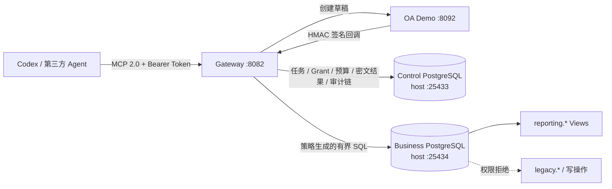

# 架构与安全边界

Gateway 把数据访问绑定到不可扩权的 `TaskGrant`：主体、目的、产品、字段、强制 Scope、敏感级别、预算、期限、Catalog 版本和审批凭证缺一不可。Agent 提交的结构化对象、QueryPlan 和 SQL 都是不可信输入；Gateway 内没有模型调用。



## 信任域

| 信任域 | 输入与职责 | 边界 |
|---|---|---|
| Agent / MCP 客户端 | 显式提交产品、字段、Scope、QueryPlan 或 SQL | Bearer Token 映射固定 Principal；Alice 只能访问自己的任务，Carol 只有审计工具 |
| Gateway 控制面 | Catalog、任务状态、OA 回调、Grant、预算、结果与审计 | 独立控制 PG；行级锁串行化状态和预算；Grant/审计 Trigger 禁止修改；审计链头加锁后连续追加 |
| 业务数据面 | 执行通过策略的查询 | 独立业务 PG；`gateway_reader` 仅有 Reporting Views 的 `SELECT`；只读事务、超时和行数上限 |

Docker 宿主机、Catalog 管理者及能读取 `.env`/Volume 的管理员属于可信运维域。两个 PG 虽然对本机调试开放端口，但只绑定 `127.0.0.1`，账号、数据库和 Volume 相互独立。

## 完整数据流

1. Agent 调用 `list_data_products`，读取逻辑产品、字段和 Scope 的完整允许值/日期边界。
2. Agent 调用 `request_data_task`，显式提交目的、非空产品列表、每个产品的非空字段列表、Scope 和可选缩小预算。Gateway 不推断缺失授权。
3. Gateway 按 Catalog 校验并规范化申请，确定敏感级别、审批路由、预算和 TTL；客户端预算只能缩小 Profile 上限。
4. Gateway 对授权快照计算 SHA-256，同时保存 pending 上下文并创建 OA 草稿。低敏汇总自动批准，高敏明细由 Bob 决定。
5. 回调处理校验 HMAC、双时间戳、Event ID、状态、actor、Catalog 版本、callback context 和快照 Hash。在一个 PostgreSQL 事务中锁定任务与回调行，写审批事件、不可变 Grant、预算和新状态。
6. ACTIVE 任务可调用 `execute_plan` 或 `query_sql`。QueryPlan 由本地 Go 包严格验证并确定性编译；两条路径随后经过同一套 `pg_query_go/v6` PostgreSQL AST 白名单策略。
7. 策略把物理 Reporting View 封装为只暴露获批字段和强制 Scope 的 CTE，并在最外层施加剩余行预算。
8. 控制库事务以行锁预留查询数、行数和 DB 时间；业务库在显式只读事务中执行。成功或失败均结算预算。
9. 结果以结构化 JSON 返回 Alice，并用 AES-256-GCM 加密保存到控制库；AAD 绑定 `task_id` 与 `query_id`，明文 SHA-256 用于完整性校验。
10. 查询凭证与状态事件进入全局审计 Hash Chain。追加前锁定单行 `audit_chain_head`，事务内分配连续序号、写事件并更新链头，避免并发分叉和序列回滚空洞。

## 生命周期

```text
AWAITING_SUBMISSION --submitted--> AWAITING_APPROVAL
AWAITING_APPROVAL   --approved-->  ACTIVE
AWAITING_APPROVAL   --rejected-->  ARCHIVED(rejected)
ACTIVE              --complete-->  ARCHIVED(completed)
任意未归档状态       --expire-->    ARCHIVED(expired)
ACTIVE 达到任一预算硬上限           ARCHIVED(budget_exhausted)
```

## 控制 PostgreSQL

控制 Schema 使用 PostgreSQL 原生类型：时间为 `TIMESTAMPTZ`，JSON 为 `JSONB`，密文/Nonce/回调响应为 `BYTEA`，预算和审计序号为 `BIGINT`。应用写入时间统一为 UTC 微秒精度。

Gateway 启动时执行嵌入式迁移，再完成中断恢复：

- RESERVED 查询按完整预留量保守计费并标记 `INTERRUPTED`。
- PROCESSING 回调恢复为可重试。
- 过期任务被归档。
- 运行期结算持久化失败会使 readiness 失败并由后台重试。

当前仍只部署一个 Gateway 实例。PostgreSQL 行锁解决单实例内并发请求安全，但没有跨 Gateway 执行租约；在实现分布式租约或等价协调前不要横向扩容 Gateway。

## 防御纵深

- Catalog 启动时严格校验未知字段、重复对象、明文密码、非法物理 View、危险函数和不一致 Scope。
- QueryPlan 只包含声明式字段；编译器验证产品、字段、聚合、过滤 literal、排序和 Limit，不接受 SQL 片段。
- SQL 决策基于 PostgreSQL AST，策略错误不返回物理对象名或解析器细节。
- 业务数据库角色权限、只读连接/事务、服务端超时和行数上限独立于应用策略。
- PostgreSQL Trigger 阻止 Grant 与审计事件的 UPDATE/DELETE；Hash Chain 提供篡改证据。
- Gateway 与 OA 容器以非 root、只读根文件系统和 `no-new-privileges` 运行；HTTP 与两个 PG 端口只开放在宿主机回环地址。

静态 Token、本地明文 HTTP、环境变量密钥、未外部锚定审计链、内存态 OA 和单 Gateway 限制见[威胁模型](threat-model.md)。
