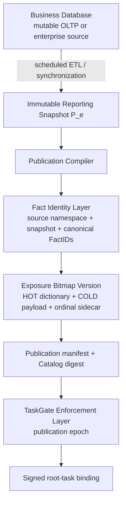
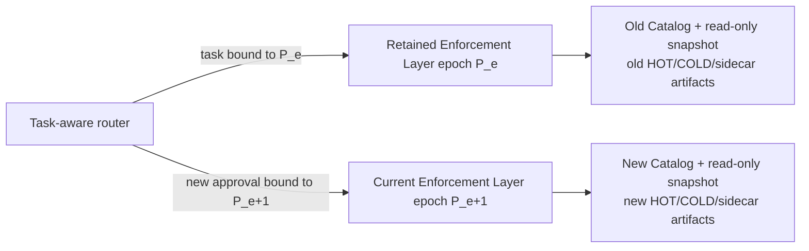

# Versioned Publication Model

Business data is not frozen. Orders arrive, customer records change, and daily
ETL produces new reporting states. TaskGate freezes only the fact-identity
namespace and publication artifacts used by an approved task. Each task can
therefore receive deterministic exposure accounting without requiring the
enterprise source database to stop changing.

## Business data continues to advance

For example:

```text
Day 1 publication                   Day 2 publication
Customer: 1,000,000 rows            Customer: 1,050,000 rows
snapshot: customer-2026-07-30        snapshot: customer-2026-07-31
publication: customer-day1-v1        publication: customer-day2-v1
```

Day 2 does not update the Day 1 publication in place. It creates a new
immutable publication version with its own snapshot ID, fact dictionary,
ordinal sidecar, artifact digests, and Catalog digest. The operational source
and ETL pipeline may continue changing independently.

TaskGate V4 serves immutable reporting publications, not a mutable OLTP primary
or a live CDC stream. "Business data is not frozen" therefore means that new
publication epochs can be produced continuously; it does not mean an active
task may query a moving relation.

## Architecture



The four required conceptual stages are the Business Database, Publication
Compiler, Fact Identity Layer, and Exposure Bitmap Version. The reporting
snapshot between the first two stages is the stable compiler input; the
manifest, Catalog, authorization, and service stages bind that output to an
executable task.

### 1. Reporting snapshot

A scheduled synchronization materializes a stable reporting relation. The
production compiler requires a populated PostgreSQL materialized view under
the restricted reporting schema, validates its ownership and schema, and
scans it in one read-only `REPEATABLE READ` transaction. Publication integrity
is a trusted operational boundary: source selection and the ETL cutoff must be
governed outside the TaskGate Enforcement Layer.

### 2. Publication compiler

`cmd/snapshot-index` derives canonical entity keys and FactIDs from database
rows rather than trusting caller-supplied keys or JSON row values. It emits an
immutable publication directory containing:

- a HOT FactID-hash/ordinal and row-handle index for online use;
- a sealed COLD canonical-payload artifact for verification and audit;
- an ordinal sidecar mapping stable entity keys to handles; and
- a bundle manifest that commits the artifacts and their digests.

The compiler refuses duplicate entity keys, noncanonical types or collations,
hash/payload disagreement, digest mismatch, and attempts to overwrite a
different publication under the same name.

### 3. Fact identity layer

Within a publication-owned source namespace, the conceptual fact identity is

\[
F=(\mathit{snapshot},\mathit{entity},\mathit{attribute},\mathit{version}).
\]

The snapshot is part of identity. Consequently, the Day 1 and Day 2 versions
of the same customer field are distinct facts even when the displayed value is
unchanged. Derived facts bind the complete source-namespace/snapshot bundle,
so a query joining multiple publications cannot lose their version context.

The FactID does not embed the final publication-manifest digest, which would
create a self-reference. Instead, source namespace and snapshot bind the fact
directly, while the signed Catalog, publication manifest, dictionary, and
sidecar digest chain proves which immutable publication owns it.

### 4. Exposure bitmap version

The publication compiler maps every base FactID in a segment to one immutable
`uint32` ordinal. Release and dependency sets can then be settled with exact
compressed bitmap difference, union, and cardinality. This ordinal assignment
is local to its dictionary version: an ordinal from Day 1 must never be
interpreted using the Day 2 dictionary.

## Publication identity and task binding

In the current Catalog schema, an executable publication is identified by a
chain equivalent to

\[
P_e=(\mathit{CatalogSHA},\mathit{publicationName},
     \mathit{sourceNamespace},\mathit{snapshot},
     \mathit{manifestDigest},\mathit{dictionaryDigest},
     \mathit{sidecarDigest}).
\]

Datasource and schema identity, Product-to-publication mappings, fields,
scopes, and budget profiles are committed by `CatalogSHA`. The signed
authorization manifest and Grant bind that exact Catalog digest. The root
ledger fixes its Catalog-wide dictionary set when it first settles, and every
delegated child must retain the root's Catalog, datasource, schema, exposure
profile, and dictionary binding.

The implementation does not store a standalone `publication_digest` in the
Grant and the ordinal manifest does not contain a separate ETL `cutoff` field.
A production publication pipeline must version the synchronization cutoff
with the immutable snapshot ID and retain that provenance. These are important
differences between the architectural epoch descriptor and the fields directly
enforced by this prototype.

## Cutover semantics

The version rule is simple:

```text
publication P_e                    publication P_e+1
historical tasks ──remain bound    new root tasks ──bind here
delegated children ──remain bound  future children of new roots ──bind here
```

- A historical task remains bound to the publication and Catalog that were
  signed at approval. It is never silently upgraded.
- A new task created after operational cutover binds the newest activated
  publication selected by the approval entrypoint.
- A delegated child inherits the exact root publication; delegation cannot be
  used as an upgrade mechanism.
- Moving work to a new publication requires a new root task and a new approval.
  Its exposure ledger starts empty.

TaskGate deliberately has no query-time `latest` binding. If an external UI or
router offers `latest`, it must resolve that label to one concrete activated
Catalog before the authorization draft is signed. Approval callbacks are
accepted only for the same retained Catalog digest; a pending draft is not
rewritten when a newer publication appears.

This design preserves historical meaning. Receipts, result artifacts, and
ledger entries from Day 1 remain interpretable using the Day 1 dictionary,
while Day 2 queries use only Day 2 identities. It also defines the claim
boundary: the prototype does not deduplicate a principal's knowledge across
independently approved roots or publication epochs.

## Retained-publication deployment

The architecture required for uninterrupted cutover is:



The router must resolve an existing task's persisted Catalog version/digest to
the matching retained service. Each retained service must keep its read-only
reporting database, Catalog, sidecar, HOT/COLD artifacts, and required result
objects for as long as its active tasks can execute. Artifacts may be reclaimed
only after task and retention policy permit it.

## Implemented behavior versus deployment requirement

The repository implements immutable publication compilation and validation,
Catalog/Grant binding, per-query binding checks, exact dictionary-bound
settlement, and fail-closed rejection on mismatched artifacts. The
`evaluation/daily-publication-online` harness also exercises old-task and
new-task routing across retained, already-constructed epoch services.

The default deployment does **not** implement a production `latest` router or
hot-swap one running `Service.catalog`. Default Compose starts one enforcement-layer
epoch. Preserving old-task availability across a daily switch therefore
requires external, task-aware routing and retained epoch services like the
architecture above. If an operator replaces the single epoch without that
retention and routing layer, the safe behavior is to reject the old task, not
to run it against the new publication.

Additional current boundaries are:

- no active-ledger migration or cross-publication ledger union;
- no mutable OLTP/CDC query serving under V4;
- no automatic reapproval of tasks or pending drafts at cutover;
- no claim that one epoch service can be horizontally scaled without an
  external execution lease; and
- publication/ETL governance, cutoff retention, and epoch routing remain
  trusted deployment responsibilities.

These limitations do not weaken fact identity within one approved epoch, but
they constrain the operational claim: historical continuity is an architecture
that the deployment must provide, not an automatic behavior of the single
enforcement-layer process.

For the ledger transition itself, see [TaskGate Exposure Model](exposure-model.md).
For compiler and bitmap details, see [TaskGate V4](exposure-v4.md). Operational
Catalog fields and validation rules are documented in
[Catalog Guide](catalog-guide.md).
